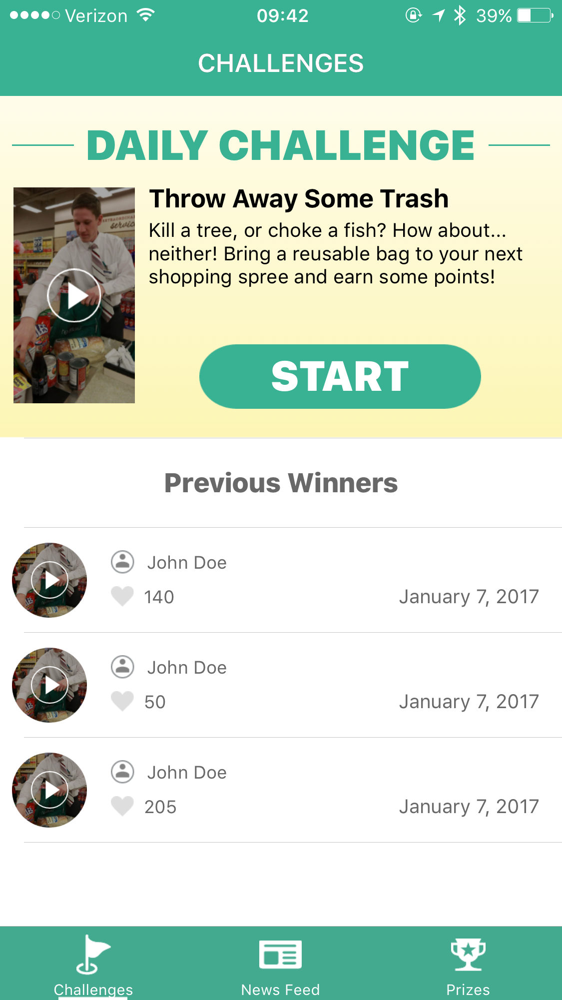

## Cal Poly Hackathon 2017
### Team Turn Down 4 Watt

* Max Bendick - Developer
* Elliot Fiske - Developer
* Antonio Flamenco - Designer
* Leann Hillegas - Designer
* Myra Lukens - Developer
* Nick Sinai - Entrepreneur

### Demo
EcoStreak, an iOS app to engage Cal Poly students with being sustainable.

Students are given a daily challenge to complete

They can view submissions from peers who have completed the challenge

And win prizes based on their "streaks," or consecutive days of completing challenges

